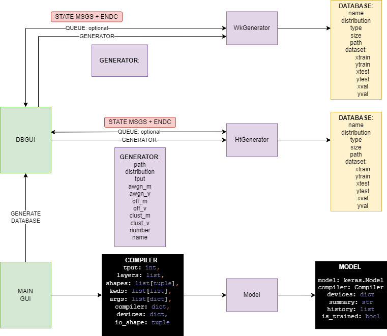
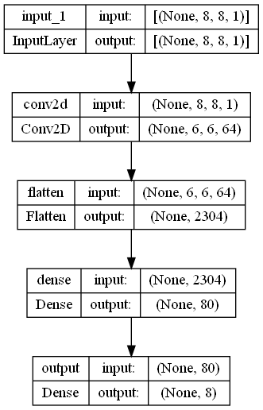

# CorNet: Correlation solving methods based on Deep Learning Models.


# Cornet Api Package - 0.1.0

This package implements an API over Keras and Tensorflow to build Deep Learning models easily. It implements a GUI
that allows us to research in the Correlation Clustering problem.

## About ##

Author: A.Palomo-Alonso (alberto.palomo@uah.es)\
Universidad de Alcalá.\
Escuela Politécnica Superior.\
Departamento de Teoría De la Señal y Comunicaciones (TDSC).\
ISDEFE Chair of Research.

## What's new?

### < 0.1.0
1. All included:
   * Model GUI: All not mentioned in future sections was included.
   * Database GUI: HtGenerator included, such as logfile.
   * Model: Multiprocessing-bypass, fit, building, save-load and multi GPU.
   * Database: Multiprocessing, save-load, HtGenerator, Generator, Dataset.
   * LaTeX Reports.
   * Adaptation with Keras.

## Install

To install the API you need to install the following software:

   * CUDA: To use the GPU training (in case you your GPU for trining).
   * CuDNN: To use the GPU trining (in case you use convolutional layers).
   * TeX Live: To generate automatic reports about your models (it is not mandatory).
   * Graphviz: To render the model into an image (it is not mandatory but recommended).

You will need to install all the Python packages shown in the ````requirements.txt```` file. Once done, you can install 
the package via pip.
   
      pip install cornet_api

## Architecture

The API contains 5 main classes: Database, HtGenerator, WkGenerator, Compiler and Model. The HtGenerator creates a
sytetic database from the given parameters and the WkGenerator creates it from Wikipedia queries. They both generates a 
Database instance used to train the Model. The model is build via the Compiler Class.




## Usage

### Model - Compiler: Building your models.

The Model is a class containing all the parameters that defines a Deep Learning model. To build a Model we need a Compiler. The compiler takes as input all the parameters of the Model: 

    from cornet_api import Compiler, Model

    compl = Compiler( io_shape=((8, 8, 1), 8),
                      layers=['Conv2D', 'Flatten', 'Dense'],
                      shapes=[(64, 3), (None,), (80,)],
                      kwds=[[None], [None], [None]],
                      args=[[None], [None], [None]],
                      compiler={'loss': 'mean_squared_error', 'optimizer': 'adam', 'metrics': 'accuracy'},
                      devices=Compiler.show_devs())

where:
1. ```io_shape```: Defines the input and output shape of the model. The argument is stored in a tuple where the first
parameter is the input shape as a tuple representing a tensor, and the second item of the tuple represents the output 
as a conventional Dense layer.
2. ```layers```: It is a list with the name of the layers. It can import all the Keras layers and custom layers.
3. ```shapes```: It is a list of tuples with the shapes of each layer. The length of the list of shapes must be equal 
to the length of the list of layers.
4. ```kwds```: It is a list of list of strings with the name of the input arguments to the kayer.
5. ```args```: It is a list of list of arguments referred to the ```kwds``` argument. To see which arguments can a layer
take as input, see the documentation of each layer.
6. ```compiler```: It is a dictionary with 3 items:
   * ```'loss'```: It is the loss function for the model.
   * ```'optimizer'```: It is the optimizer of the model.
   * ```'metrics'```: It is a string or a list of strings with the metrics to be represented when training the model.
7. ```devices```: It is a dictionary with the name of each device in the machine that can train the model with the 
items listed below. To see the available devices you can call the ```Compiler.show_devs()``` method that does not 
require an instance to be executed.
   * ```0```: This device does not train the model.
   * ```1```: This device will train the model with an static dataset.
   * ```2```: This device will train the model in the real time feed.

Once the compiler is built, we can check if the compiler is correct built with:

    compl.is_valid

        >   True

You can save and load the compile with ````compl.load()```` and ````compl.save()```` methods but we don't recommend it
as long as you can save the model insted of its Compiler.

To compile the model we can just call the ````compile()```` method as follows:

    cornet_model = compl.compile()

Tensorflow can warn you that you did not select GPU devices. Ignore this message if you are training your models with a
CPU instead of a GPU or TPU. You can check the model summary with the ````summary```` attribute.

    print(cornet_model.summary)

        >   Model: "model"
           _________________________________________________________________
            Layer (type)                Output Shape              Param #   
           =================================================================
            input_1 (InputLayer)        [(None, 8, 8, 1)]         0         
                                                                            
            conv2d (Conv2D)             (None, 6, 6, 64)          640       
                                                                            
            flatten (Flatten)           (None, 2304)              0         
                                                                            
            dense (Dense)               (None, 80)                184400    
                                                                            
            output (Dense)              (None, 8)                 648       
                                                                            
           =================================================================
           Total params: 185,688
           Trainable params: 185,688
           Non-trainable params: 0
        >   _________________________________________________________________

    cornet_model.is_trained

        >   False

You can load and save the models with the ````load(path)```` and ````save(path)```` methods. These methods takes two 
paths as input: the model path [0] and the compiler path [1]. The compiler is saved apart from the model as the Keras 
models are not pickable and they must be stored in a ````.h5```` format. If you only provide one argument to load and 
save methods (which is highly recommended), the mathod automaticly saves the compiler and the model in the same path and 
deals with this issue by itself.

      cornet_model.save('./mymodel.h5')          #  The compiler is saved as './mymodel.cpl'
      _cornet_model = Model.load('./mymodel.h5') #  The method can be called inside the class.
      del _cornet_model

There are alternative ways to build a Model. You can create a dummy Model and insert the model and the compiler 
manually, but it is not recommended as is the same as giving the compiler as a parameter:

      _cornet_model = Model(None)
      _cornet_model.compiler = compl
      _cornet_model.devices = compl.devices
      _cornet_model.compile()
      print(_cornet_model.summary)
         
         >  Model: "model" [...]

If somehow you obtain a Keras model and you want to pack it into the API, you dont need to save and load it, as you can 
import the model:

      my_keras_model = ObtainKerasModelSomehow()
      _cornet_model = Model(None, model=my_keras_model)
      print(_cornet_model.summary)
         
         >  Model: "model" [...]

      del _cornet_model

You can also visualize your model if you installed the graphviz app:

      cornet_model.model_print()
      #  Or cornet_model.model_print(custom_directory_path)

And open ````./compiled-model.gv.png````, showing the following figure:



### Generators - Database: Building your custom database.

The Correlation Clustering problem requires a type of specific matrix, this can be built
with the classes ````Generator````, ````HtGenerator```` and ````WkGenerator````. First, we need to obtain a
valid Generator.


      from cornet_api import Generator, HtGenerator
      
      my_generator = Generator(
               path='./mydatabase.ht',
               distribution=(50, 30, 20),
               tput=16,
               awgn_m=0,
               awgn_v=0,
               off_m=0,
               off_v=0,
               clust_m=3,
               clust_v=1,
               number=64,
               name='64_noiseless_database'
      )
      my_generator.is_valid

         >  True

      ht_generator = HtGenerator(my_generator)
      database = ht_generator.build()

You can also build the Database without a generic Generator, which is also recommended:

      ht_generator = HtGenerator(
               path='./mydatabase.ht',
               distribution=(50, 30, 20),
               tput=16,
               awgn_m=0,
               awgn_v=0,
               off_m=0,
               off_v=0,
               clust_m=3,
               clust_v=1,
               number=64,
               name='64_noiseless_database'
      )
      database = ht_generator.build()

The generator also has a status report for ````multiprocessing.Queues````. Due to the possible computational
load that building a Database requires (specially for that ones with higher throughput and number of samples), the 
Generators can be instanced in a separate process and keep the communication with the master process via 
````Queues````. We provide an example:

      from multiprocessing import Process, Queue
      from cornet_api import Database
      
      queue = Queue()
      child_arguments = (my_generator, queue)
      child_process = Process(target=HtGenerator, args=child_arguments)
      child_process.start()

      #  Main program.
      pass

      #  Recieve all the information from the child process.
      command = ['Starting to control the communication...']
      while command[-1] != 'ENDC':
         print(command[-1])
         command.append(queue.get())
         

      >  Starting to control the communication...
         Building HT database 0 / 64.
         Building HT database 1 / 64.
         Building HT database 2 / 64.
                     [...]
         Building HT database 63 / 64.
      >  Building HT database 64 / 64.

      database = Database.load(my_generator['path'])

Note that the end of the generation of the database is communicated with the 'ENDC' string in the provided queue.
You can omit passing the queue argument to the HtGenerator, but the master program wont have feedback of the
work of the child process.

### Dataset - Database: Building other type of databases.

If, somehow, you already have a dataset (````other_dataset````), you can build a dataset compatible with the API. You must import 
````Dataset```` and create two new attributes in your database:
1. ````dataset````: It is a dataset structure with 6 parameters:
   * xtrain: The samples of the train dataset.
   * ytrain: The solutions of the train dataset.
   * xval: The samples of the validation dataset.
   * yval: The solutions of the validation dataset.
   * xtest: The samples of the test dataset.
   * ytest: The solutions of the test dataset.
2. ````batch_size````: It is an integer with the batch size of the database.

In the proposed example:

      from cornet_api import Dataset
      other_database = get_other_database()
      
      dataset = Dataset(
            xtrain=other_database.get_train_x(),
            ytrain=other_database.get_train_y(),
            xtest=other_database.get_test_x(),
            ytest=other_database.get_test_y(),
            xval=other_database.get_validation_x(),
            yval=other_database.get_validation_y(),
      )
      batch_size = 64
      
      other_database.dataset = dataset
      other_database.batch_size = batch_size
      # Or:
      other_database.__dict__.update({dataset: dataset, batch_size: batch_size})


Now the external database is valid for training.

### Deep Learning: Fitting the model.

Once our models and databases are built (```cornet_model``` and ```database```), we can start training our models.
We need to provide a valid dataset for the ````Model.fit()```` method and the number of epoch.

   
      cornet_model.fit(database, epoch=5)

         >  [1, 0.05, 0.025, 0.0025, 0.00025]

It is as simple as that. 

However, some software can require an external process to take care of the 
computational load of fitting a Deep Learning Model. The main problem is that the Keras models are not pickable,
so we need to make use of the ```Model.fitmodel()``` method. This method can work in different ways, but the
recommended method is to use a bypass temporal file:


      from multiprocessing import Process, Queue
      from cornet_api import Model
      import os

      bypass = cornet_model.bypass('./bypass')
      queue = Queue()
      child_process = Process(target=Model.fitmodel,                                        
                              args=(cornet_model, database, queue),
                              kwargs={'bypass': bypass}))
      child_process.start()

      #  Main program.
      while(main_loop):
         #  Recieve all the information from the child process.
         if not queue.empty():
            history = queue.get()

      #  Send the MASTER:STOP trining command to the child process to stop it.
      queue.put('MASTER:STOP')
      #  Recover the model from the child process.
      cornet_model.bypass(bypass)
      cornet_model.is_trained

         >  True

The child process will be training the model while the main program of the
master process is running. The child process will send to the master process the information about the losses during
the training in the provided queue. When the master sends the string ````'MASTER:STOP'```` the
child process bypasses the model and the master process can recover the model. Meanwhile, the model is not
acessible.

### Creating automatic reports: experimental.

To generate automatic reports, if you installed ```TeX Live```, we need to create a folder like the following:

      /temp -------
               |
               |---- /latex-------
               |              |
               |              |---- commands.txt
               |              |---- main.tex
               |              |---- number
               |              |---- summary.txt
               |              |
               |              |---- /imgs ------
               |              |              |

Where the commands.txt and summary.txt can be empty files. However, number must contain a number and only a number. It is recommended to be initialized to 0.
Main.tex must be the file you can find in this same package: ```/temp/latex/main.tex```.

      Report('./temp/latex/', './compiled-model.gv.png', cornet_model, database, cornet_model.history, author='Me', number='REPORT_N_304')

This generates a report with the config file settings (see ```/config/config.json```).
### Interfaces

Do you want to use the API without typing a single line of code? We built a
GUI for you!

   >  TODO: GUI doc.

### Cite as

~~~
@misc{cornetapi,
  title={CorNet: Correlation clustering solving methods based on Deep Learning Models},
  author={A.Palomo-Alonso, S.Jiménez-Fernández, S.Salcedo-Sanz},
  booktitle={PhD in Telecommunication Engeneering},
  year={2022}
}
~~~
