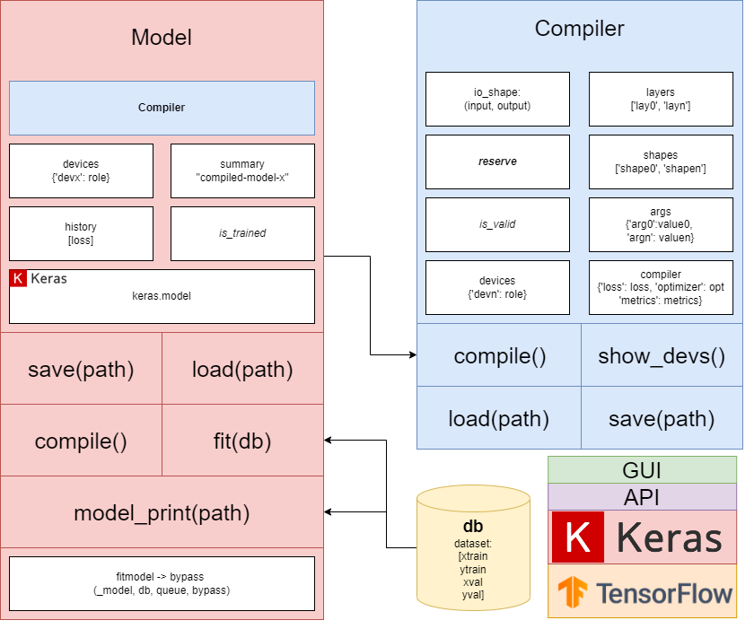

# CorNet: Correlation solving methods based on Deep Learning Models.

# Cornet Api Package - 0.1.0

This package ...

## About ##

Author: A.Palomo-Alonso (alberto.palomo@uah.es)\
Universidad de Alcalá.\
Escuela Politécnica Superior.\
Departamento de Teoría De la Señal y Comunicaciones (TDSC).\
ISDEFE Chair of Research.

## What's new?

### < 0.1.0
1. <Nothing yet?>

## Architecture

### Model class

### Database class

## Usage

The basic us

> model = Compiler(
>	io_shape= ((8, 8, 1), 8),
>	layers=['Conv2D', 'Flatten', 'Dense'],
>	shapes=[(64, 3), (None,), (80,)],
>	kwds=[[None], [None], [None]],
>	args=[[None], [None], [None]],
>	compiler={'loss': 'mean_squared_error', 'optimizer': 'adam', 'metrics': 'accuracy'},
>	devices=Compiler.show_devs()).compile()

### Install

### Basic usage

### Interfaces

### Cite as

~~~
@misc{cornetapi,
  title={CorNet: Correlation solving methods based on Deep Learning Models},
  author={A.Palomo-Alonso,S.Jiménez-Fernández, S.Salcedo-Sanz},
  booktitle={PhD in Telecommunication Engeneering},
  year={2022}
}
~~~